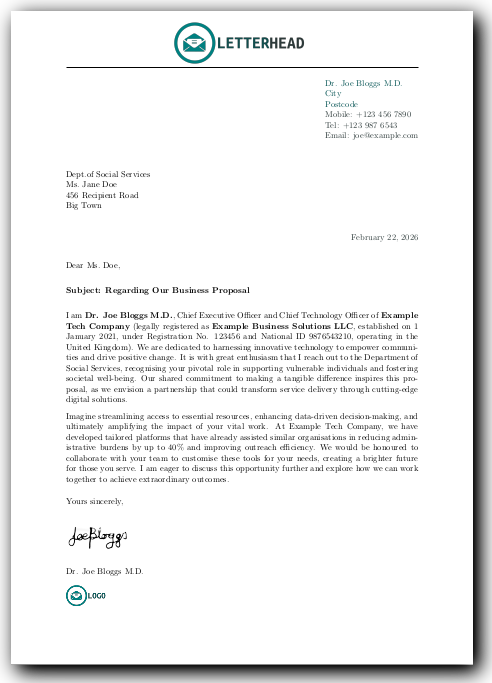

# LaTeX Standard Business Letter Template

[](https://github.com/DavitTec/latex-letter-std-business/releases)
[](https://github.com/DavitTec/latex-letter-std-business/issues)
[](https://github.com/DavitTec/latex-letter-std-business)
[](https://github.com/DavitTec/latex-letter-std-business)

This is a minimalist LaTeX template using **letter.cls** for professional business letters. It supports customisable sender/recipient details, tones (formal/informal), letterhead/logo, signatures, colours, and subject lines. Ideal for invitations, proposals, or formal correspondence.



## Features

- Clean, single-page layout with optional multipage toggle.
- Customise metadata (sender, recipient, tone) via [metadata.tex](metadata.tex).
- Support for letterhead (with on/off switch), logo, and signature images.
- Colour schemes for sender details (using xcolor).
- Fixed positioning for window envelopes.
- Subject/reference line.
- Database/JSON compatible structure (via \def macros).
- Limitations: Basic letter.cls—no auto-paragraph indent; use extensions for advanced needs.

## Getting Started

### Prerequisites

- LaTeX distribution (TeX Live on Linux Mint MATE).
- Optional: Visual Studio Code Insiders with LaTeX Workshop extension, or Texmaker.
- pnpm for any Node.js scripts (e.g., generating metadata from JSON).

### Usage

1. Clone the repo:

   ```bash
   git clone https://github.com/yourusername/latex-letter-std-business.git
   cd latex-letter-std-business
   ```

2. Update metadata.tex with your details (e.g., sender, recipient, tone).

3. Place images in src/ (letterhead.png, logo.png, signature.png).

4. Compile:

   ```bash
   mkdir -p build
   pdflatex -output-directory=build main.tex
   ```

Output: build/main.pdf.

For continuous build in VS Code Insiders: Use LaTeX Workshop (Ctrl+Alt+B).

## File Structure

```bash
latex-letter-std-business/
├─ main.tex           # Main LaTeX file with preamble and includes.
├─ content.tex        # Letter body, salutation, subject, and closing.
├─ metadata.tex       # Customisable vars (sender, recipient, tones, images).
├─ src/               # Images (letterhead.png, logo.png, signature.png).
├─ config/            # (Future) config.json for overrides.
├─ build/             # Compiled outputs (gitignore this).
├─ docs/              # (Future) TODO.md for features.
├─ README.md          # This file.
├─ LICENSE            # MIT License.
```

## Customisation

- Tone/Salutation: Set \def\tone{formal} in metadata.tex.
- Colours: Edit \definecolor in metadata.tex.
- Positions: Adjust \vspace\* in \opening redefinition for sender/recipient/date.
- Build Script: See [TODO.md](docs/TODO.md) for planned bash/JS script.

## License

MIT License. See [LICENSE](LICENSE) file.

Copyright © Davit Technologies 2026

Version: 3.7
